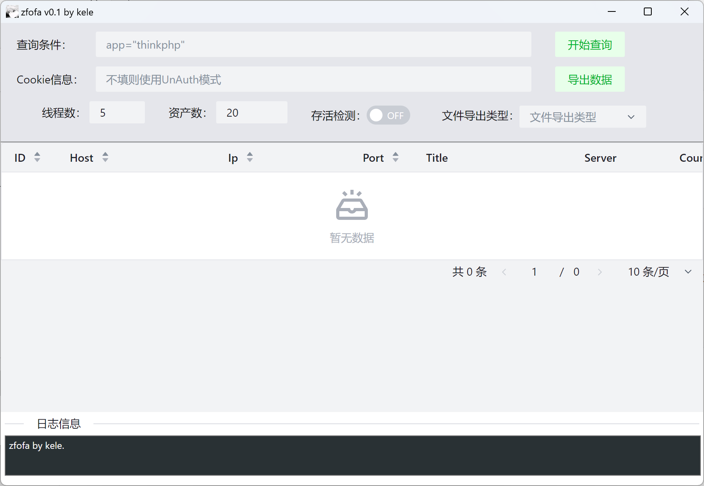
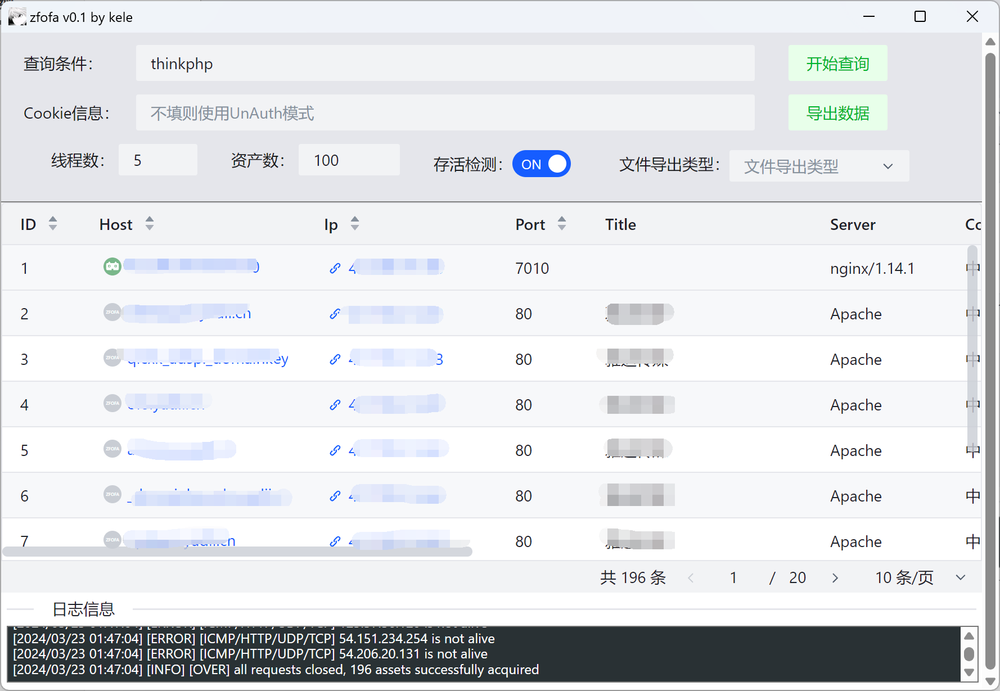

# zfofa

## About
zfofa是一个Fofa资产导出工具，支持白嫖部分Fofa资产，以及利用Fofa个人会员账户抓取资产两种方式

> 常见的Fofa资产提取工具大多采用Fofa提供的API导出，因此编写一个利用正则抓取官网页面数据的工具

- 利用Cookie爬取数据：适用于个人会员，对每日API有限制额度的账户
- 不利用Cookie抓取数据：利用Fofa提供的语法（时间类），通过不断修改间隔时间抓取数据（因此得到的数据不一定全，可能多也可能少）


## Support

- [x] 支持会员账户Cookie和直接利用两种方式
- [x] 支持TXT、CSV、JSON三种格式的资产导出
- [x] 支持HTTP代理
- [x] 支持抓取完成资产后进行存活检测（采用ICMP、TCP、UDP、HTTP检测）
- [x] 支持资产去重，采用对Host、Ip、Port三个字段进行比较去重（只有三者完全相同才被定义为重复资产）


## Use

### 编译安装

方法一：

- 前往Release页面直接下载可执行文件即可

方法二：

- 项目采用Go+Wails开发，编译很简单，只需要克隆源码在本地后，直接执行以下命令编译即可

> 详情参考：[Wails官方文档](https://wails.io/docs/gettingstarted/installation)

```bash
wails build
```


### 使用

- 第一次使用会生成一个`config.yaml`的配置文件和`*.log`的日志文件，配置文件内容如下

```yaml
userinfo:
    fofa_token: fofa_token	# Cookie中的fofa_token字段内容
fofa_tool_conf:
    max_try_fetches: 7	# 非登陆模式下，当连续请求max_try_fetches次无内容时，停止继续请求
    between_after_time_and_before_time: 7	# 非登陆模式下，时间类之间的间隔天数
    http_proxy: http://ip:port	# 配置代理
    max_check_alive_workers: 100	# 存活检测时的并发数量
```


- 再次点击可执行文件即可使用






## Help

- 模式切换？

> 当配置文件中的`fofa_token`配置被修改后，默认使用Cookie认证的方式请求数据，当配置项没有被修改时，则以UI中的Cookie信息是否填入判断，如果填入了Cookie信息，则使用认证的方式请求，否则不进行Cookie认证，直接抓取数据
>
> - 需注意：UI中的Cookie信息优先级大于配置文件的优先级

